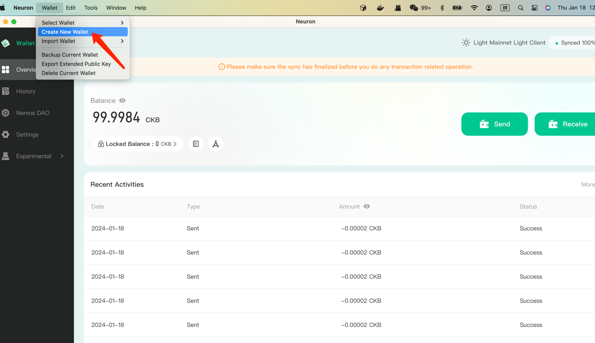
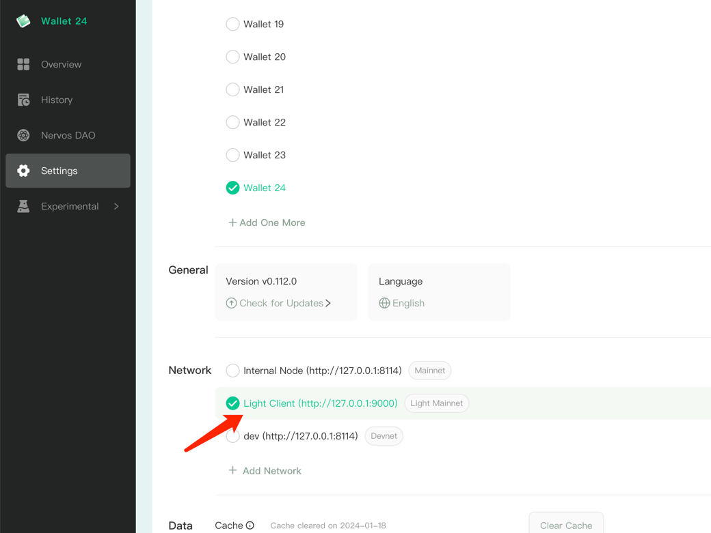

### Download neuron 
https://github.com/nervosnetwork/neuron/releases/tag/v0.112.0

### create new account 


### change to light mode 


### get mm account private key
修改 `action/get-neuron-account.ts`的 `MNEMONIC`，设置自己的助记词信息
```shell
npm i 
ts-node action/get-neuron-account.ts
```
获取 privKey 填入 `action/config.ts` 的`SECP256K1_PRIVATE_KEY`

### 轻节点提取 mint 合约信息
```shell
ts-node action/fetch-light-deps.ts
```

### 启动轻节点模式
修改 action/config.ts `LIGHT_MODE`
```shell
LIGHT_MODE = true
```

### 之后等待neuron钱包到账后，就可以按照`README` 文档mint 交易
```shell
npx ts-node action/split.ts

npx ts-node action/first-mint.ts

npx ts-node action/loop-mint.ts

```